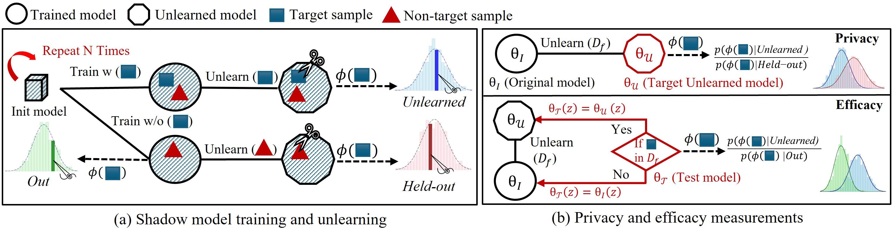

##  RULI: Rectifying Privacy and Efficacy Measurements in Machine Unlearning: A New Inference Attack Perspective

Welcome to **RULI**! 🎉 This repository is the official implementation of the paper "Rectifying Privacy and Efficacy Measurements in Machine Unlearning: A New Inference Attack Perspective" accepted by USENIX Security '25, which provides a MIA attack to evaluate the Efficacy and Privacy Leakage of Machine Unlearning.


#### Update: This repository now contains codes and instructions to use RULI. Stay tuned for more updates!
> **Required**: Please ensure you have the necessary dependencies. (See [Pre-requisites](#-pre-requisites) for details.)
 
> **Getting Started**: Refer to [Usage Instructions](#-usage) for a comprehensive step-by-step guide.  

> **Quick Demo**: Visit [examples](#-scripts) for a streamlined setup and demo execution.
---




## Usage- Image Datasets

Follow these steps to run the code effectively:

### 1️⃣ **Step 1 (Optional)**: Identify Protected and Vulnerable Samples  
This step is required only if you need to identify protected and vulnerable samples for the attack. If you already have these samples (provided by us), you can skip this step.

- **Command**: Run Standard LIRA to identify protected and vulnerable samples.  
  Example for CIFAR-10 dataset with ResNet-18:  
  ```
  python recall_main.py --dataset cifar10 --train_epochs 50 --shadow_num 128
  ```
- **Output**: The indices of protected and vulnerable samples will be saved to the specified path for use in subsequent steps.


### 2️⃣ **Step 2**: Train and Unlearn Shadow Models  
Train shadow models and save the chosen outputs (defaults is logit-scaled confidences) for each sample. This step also performs the attack.  

- **Command**: Run the following script:  
  ```
  python unlearn_mia.py --vulnerable_path your_vulnerable_file --privacy_path your_protected_file --dataset cifar10 --shadow_num 90 --task mixed --train_shadow --unlearn_method Scrub --config_path "$CONFIG_PATH
  ```
- **Output**: Shadow models are trained, and the attack is performed. If you already have prepared shadow models, skip to Step 3.


### 3️⃣ **Step 3.1**: Run the Attack (Efficacy and Privacy Leakage)  
Evaluate the efficacy and privacy leakage of the unlearning method in a single run.  

- **Command**: Run the following script:  
  ```
  python unlearn_mia.py --vulnerable_path your_vulnerable_file --privacy_path your_protected_file --dataset cifar10 --task mixed --unlearn_method Scrub --config_path "$CONFIG_PATH
  ```
- **Output**: (1) Results for both efficacy and privacy leakage. (2) Average case attacks (population) results are also shown as the baseline for privacy leakage.


### 3️⃣ **Step 3.2**: Run the Attack (Privacy Leakage on Canary Samples)  
Evaluate privacy leakage using canary samples for a more realistic scenario.  

- **Command**: Run the following script:  
  ```
  python unlearn_mia_canary.py --vulnerable_path your_vulnerable_file --privacy_path your_protected_file --dataset cifar10 --task mixed --unlearn_method Scrub --saved_results $SAVED_PATH --config_path "$CONFIG_PATH
  ```
- **Output**: Privacy leakage results for canary samples.  


##  Unlearning Configs

#### `--task`
Specifies the task to perform. Options include:
- `class-wise`: Random samples from a specific class.
- `selective`: Random samples from the dataset.
- `mixed`: Vulnerable and protected samples with equal sizes (**requires Step 1**).
- `canary`: Vulnerable samples and random samples with equal sizes (**requires Step 1**). 
  - *Note*: Use `canary` only for privacy leakage evaluation.
  - *Note*: For each `--task`, the corresponding shadow models should be trained and unlearned. 

#### `--unlearn_method`
Specifies the unlearning method to perform. Options include:
- `Scrub`
- `FT`: Fine-tuning/Sparse Fine-tuning
- `GA+`
- `NegGrad+`

#### `--config_path `
Reference to the configuration file for unlearning hyperparameters loaded from JSON file. 
It is preferred to use the same settings for training shadow models (Step 2) and target model (Step 3). Example: `--config_path ./core/unlean_configs.json`

## Example Scripts

The `.core/examples` directory offers ready-to-use scripts to make running the code as smooth as possible.

- **Effortless Setup**: Run the code with minimal configuration—no hassle, just results.  
- **Pre-prepared Data**: Vulnerable and protected samples for CIFAR-10, CIFAR-100, and TinyImageNet datasets are included for quick demonstrations. Access them easily via Zenodo.  
- **Save Time with Shadow Models**: Skip the lengthy shadow model training process! Precomputed shadow distributions for CIFAR-10 and TinyImageNet are available, letting you jump straight into toy demos and focus on results.  
- *(Find all resources on Zenodo)*


## Usage - Text Dataset (s)


### 1️⃣ Step 1: Identify n-gram random samples

Run the `target_data.py` file to prepare random samples from the WikiText-103 validation data. Example:
```
python target_data.py --model_name gpt2 --dataset_name WikiText103 --num_target_samples 1000 --max_length 128 --save_dir ./data/WikiText-103-local/gpt2/selective_dataset_prefixed
```

please refer to the `./text` folder and run the bash file `shadow_script.sh` to run the shadow models.
Here is the equivalent python command that reflects the parameters set in the bash script. 
```
python attack_main.py --sft_epochs 5 --unlearn_epochs 15 --unlearn_method npo --shadow_num 3 --prefix_epochs 1 --target_data_path ./data/WikiText-103-local/gpt2/selective_dataset_prefixed --device cuda:0
```
This command will save the target samples outputs, which are required for running the attack. To perform the attack using the npo unlearning method, use the following command
```
python mia_inference.py --shadow_path PATH --unlearn_method npo --sft_epochs 5 --unlearn_epochs 15
```


##  Pre-requisites

Before running the code, make sure you:

- Create a conda environment (Python 3.8 or higher) (example for Python 3.11):
```
conda create -n <env_name> python=3.11
conda activate <env_name>
```
- Install _pytorch_ and _tensorflow_ versions that fits your machine.
-  Please ensure you have the necessary dependencies installed. You can find them in the [requirements.txt](./requirements.txt) 
file and install them. (install using `pip install -r requirements.txt`).


### Datasets

##### _CIFAR-10 and CIFAR-100_
These datasets will be automatically downloaded into `./core/data/` when running any related code, if they are not already available.

#### _TinyImageNet_
To use the TinyImageNet dataset, download it manually and place it in the `./core/data/` directory. You can download the dataset from [this link](https://www.kaggle.com/datasets/akash2sharma/tiny-imagenet).

#### _WikiText Dataset_
The Wikipedia dataset will be automatically downloaded into the `./text/data/` directory using the Hugging Face `datasets` library. You can also find the dataset [here](https://huggingface.co/datasets/Salesforce/wikitext/tree/main/wikitext-103-v1).

#### _Any other Datasets_

You may additionally load any other dataset with slight modifications to the code. Our ./core/loader.py file is designed to handle various datasets, and you can refer to it for guidance on how to load your custom dataset. For text datasets, you can refer to the `./text/utils.py`  file and find `load_data` for loading and processing text data.


###  Acknowledgements

We would like to thank the authors of the following repositories for publicly sharing their code, which served as valuable references for our implementation.

- [muse-bench](https://github.com/swj0419/muse_bench)
- [SCRUB](https://github.com/meghdadk/SCRUB)
- [Unlearn-Sparse](https://github.com/OPTML-Group/Unlearn-Sparse)

